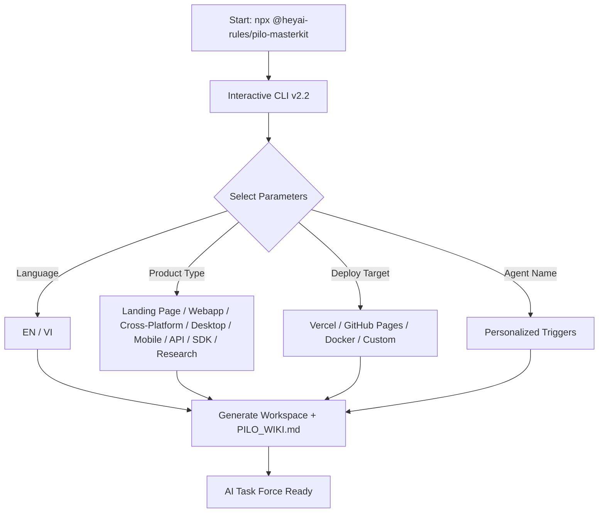
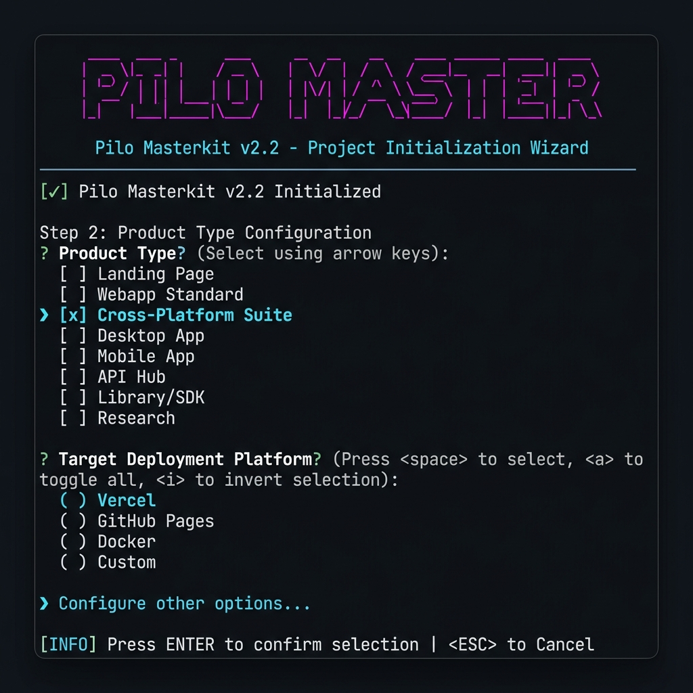
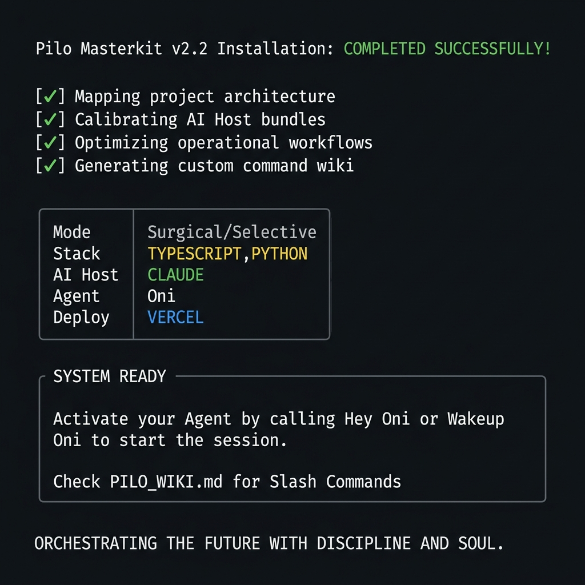

<div align="center">
  

# 🤖 Pilo Masterkit

  <p><b>The ultimate AI Coding Assistant standardizer and workspace initializer.</b></p>

[](https://www.npmjs.com/package/@heyai-rules/pilo-masterkit)
[](https://github.com/Arter2507/pilo-masterkit/releases)
[](https://opensource.org/licenses/Apache-2.0)

[**English**](#-english) | [**Tiếng Việt**](#-tiếng-việt)

</div>

---

## 🌎 English

### 🎯 Project Purpose

`Pilo Masterkit` transforms an ordinary AI Coding Assistant into a disciplined **AI Task Force**. It acts as a comprehensive "brain" for your project — solving context loss, enforcing standardized commands, strict development rules, and high-quality design systems.

### ✨ Key Features

- **Project Context Initializer**: Creates a clean directory structure (`docs/tasks`, `docs/plans`, etc.) ready for the AI.
- **Dynamic AI Host Files**: Generates `GEMINI.md`, `CLAUDE.md`, or `AGENTS.md` fully localized in your chosen language.
- **Interactive CLI v2.2**: Step-by-step wizard with product type selection, deployment target, and personalized agent triggers.
- **Auto-Generated Wiki**: `PILO_WIKI.md` is created automatically with slash commands tailored to your stack and deploy target.
- **Deployment Target**: Choose between Vercel, GitHub Pages, Docker, or custom — the Agent will optimize accordingly.
- **Bilingual Support**: Full English and Vietnamese localization for CLI, AI hosts, and documentation.

### 🏗️ Workflow Architecture



### 📸 CLI in Action





### 🚀 Quick Start

```bash
# Interactive mode (recommended)
npx @heyai-rules/pilo-masterkit@latest init

# Non-interactive: selective stack
npx @heyai-rules/pilo-masterkit@latest --stack=typescript,python --ai=claude --locale=en

# Non-interactive: full installation
npx @heyai-rules/pilo-masterkit@latest --profile all
```

_Note: You can also use `--profile all` for or `--stack <name> --ai <host>` for non-interactive setup._

### 🎮 Slash Commands

You have access to a rich set of built-in commands for your AI:

#### **Core Utilities:**

- `/plan` - Create detailed implementation plan with risk assessment.
- `/status` - Display agent and project status.
- `/debug` - Systematic debugging with root cause analysis.
- `/tdd` - Strict Test-Driven Development protocol.
- `/clean-memory` - Clean AI Agent's memory/context to avoid bloat.
- `/code-review` - High-standard code review.

#### **Development & Deploy:**

- `/ui-ux-pro-max` - Plan and implement top-tier UI/UX.
- `/create` - Create new application functions.
- `/enhance` - Add or update features in existing applications.
- `/deploy` - Deploy to your chosen platform (Vercel, GitHub Pages, Docker...).

#### **Code Review & Quality:**

- `/cpp-review`, `/rust-review`, `/go-review`, `/python-review`, `/kotlin-review`, `/flutter-review` - Deep, language-specific code reviews.

> [!IMPORTANT]
> **View all commands**: Check out [**Slash Commands Wiki**](./SLASH_COMMANDS.md) or your project's auto-generated `PILO_WIKI.md`.

---

## 🇻🇳 Tiếng Việt

### 🎯 Mục đích dự án

`Pilo Masterkit` biến một AI Coding Assistant thông thường thành **Đội ngũ Đặc nhiệm AI (AI Task Force)** có kỷ luật. Công cụ này thiết lập "não bộ" tập trung ngay tại môi trường phát triển của bạn.

### ✨ Tính năng chính

- **Môi trường Làm việc Sạch**: Tự động khởi tạo cấu trúc thư mục sẵn sàng làm việc (Docs, Tasks, Plans...).
- **Tệp Cấu hình Động**: Sinh ra file `GEMINI.md`, `CLAUDE.md` hoặc `AGENTS.md` bản địa hóa 100%.
- **Giao diện CLI v2.2**: Trình hướng dẫn tương tác với 8 loại sản phẩm, nền tảng triển khai và trigger cá nhân hóa.
- **Wiki Tự động**: `PILO_WIKI.md` được tạo tự động với các lệnh slash phù hợp Stack và Deploy của bạn.
- **Nền tảng Triển khai**: Chọn Vercel, GitHub Pages, Docker hoặc Tùy chọn — Agent sẽ tối ưu hóa theo.
- **Song ngữ 100%**: Toàn bộ CLI, AI hosts và tài liệu hỗ trợ Tiếng Anh và Tiếng Việt.

### 🚀 Hướng dẫn nhanh

```bash
# Chế độ tương tác (khuyên dùng)
npx @heyai-rules/pilo-masterkit@latest init

# Phi tương tác: chọn stack
npx @heyai-rules/pilo-masterkit@latest --stack=typescript,mobile --ai=gemini --locale=vi

# Phi tương tác: cài đầy đủ
npx @heyai-rules/pilo-masterkit@latest --profile all
```

_Lưu ý: Có thể sử dụng `--profile all` để cài đặt đầy đủ hoặc `--stack <name> --ai <host>` để bỏ qua tương tác._

### 🎮 Lệnh Hệ Thống (Slash Commands)

#### **Quy trình Lõi:**

- `/plan` - Lập kế hoạch chi tiết, đánh giá rủi ro trước khi thực thi.
- `/status` - Kiểm tra trạng thái Agent và tiến độ công việc.
- `/debug` - Tìm lỗi có hệ thống với bảng nguyên nhân gốc.
- `/tdd` - Phát triển hướng kiểm thử (Test-Driven Development).
- `/clean-memory` - Dọn dẹp bộ nhớ/ngữ cảnh tránh "loãng" bộ nhớ.
- `/code-review` - Đánh giá mã nguồn chuẩn chất lượng cao.

#### **Phát triển & Triển khai:**

- `/ui-ux-pro-max` - Thiết kế giao diện chuẩn mực.
- `/create` - Khởi tạo luồng ứng dụng mới.
- `/enhance` - Nâng cấp tính năng hiện có.
- `/deploy` - Triển khai lên nền tảng đã chọn (Vercel, GitHub Pages, Docker...).

#### **Review & Tối ưu Mã:**

- `/cpp-review`, `/rust-review`, `/go-review`, `/python-review`, `/kotlin-review`, `/flutter-review` - Review code sâu theo từng đặc thù ngôn ngữ.

> [!IMPORTANT]
> **Toàn bộ hệ thống lệnh**: Xem [**Slash Commands Wiki**](./SLASH_COMMANDS.md) hoặc file `PILO_WIKI.md` được tạo tự động trong dự án.

---

## 🤝 Community & Contributing

Dự án này là mã nguồn mở và chúng tôi vinh danh mọi đóng góp để cải thiện hệ sinh thái AI.
_This project is open-source and we welcome all contributions._

- **[Giấy phép / License](LICENSE)**

---

> **"Orchestrating the technology of the future with discipline and soul."**
