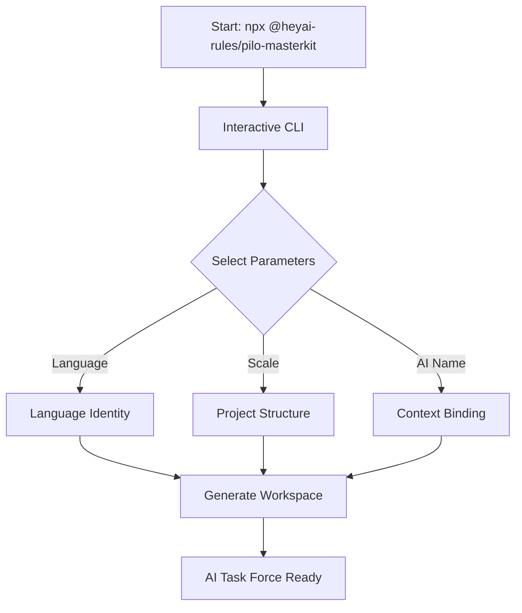

<div align="center">
  

  # 🤖 Pilo Masterkit
  
  <p><b>The ultimate AI Coding Assistant standardizer and workspace initializer.</b></p>
  
  [](https://www.npmjs.com/package/@heyai-rules/pilo-masterkit)
  [](https://opensource.org/licenses/Apache-2.0)
  [](http://makeapullrequest.com)

  [**English Version**](#english-version) | [**Phiên bản Tiếng Việt**](#phiên-bản-tiếng-việt)
</div>

---

## 🌎 English Version

### 🎯 Project Purpose

`Pilo Masterkit` is designed to transform an ordinary AI Coding Assistant into a disciplined **AI Task Force**. It acts as a comprehensive "brain" for your project, solving issues like context loss and inconsistent logic. It enforces a professional environment through standardized commands, strict development rules, and high-quality design systems.

### ✨ Key Features

- **Clean State Initiation**: Creates a completely empty directory structure (such as `docs/tasks`, `docs/plans`, etc.) ready for the AI to pick up work.
- **Dynamic Context File**: Generates `GEMINI.md` based on your product's domain, defining the AI's identity, language protocol, and operational scale.
- **Interactive CLI UI**: Start new projects friction-free via an interactive graphical CLI that prompts you through configuration options.
- **High-End Specialist Modules**: Ensures the AI adheres to the latest practices covering Architecture, Clean Code, Security, and UI/UX.

### 🏗️ Workflow Architecture



### 🚀 Quick Start

Run the following command anywhere to initialize your workspace:

```bash
npx @heyai-rules/pilo-masterkit@latest
```

### 🎮 Slash Commands

You have access to a rich set of built-in commands for your AI:

#### **Core Utilities:**
- `/plan` - Restate requirements, assess risks, and create step-by-step implementation plan.
- `/status` - Display agent and project status.
- `/tdd` - Strict Test-Driven Development protocol.
- `/debug` - Systematic debugging methodology with root cause analysis.
- `/clean-memory` - Evaluate and clean AI Agent's memory/context to avoid bloat.
- `/e2e` - End-to-end testing with Playwright.

#### **Development Capabilities:**
- `/ui-ux-pro-max` - Plan and implement top-tier UI/UX.
- `/enhance` - Add or update features in existing applications.
- `/create` - Create new application functions.
- `/deploy` - Deployment command for production releases.

#### **Code Review & Quality:**
- `/cpp-review`, `/rust-review`, `/go-review`, `/python-review`, `/kotlin-review` - Deep, language-specific code reviews focusing on idiomatic conventions and safety.

<details>
<summary><b>View ALL Available Commands</b></summary>

`/aside`, `/brainstorm`, `/claw`, `/clean-memory`, `/context-budget`, `/cpp-build`, `/cpp-review`, `/cpp-test`, `/create`, `/debug`, `/deploy`, `/devfleet`, `/docs`, `/e2e`, `/enhance`, `/evolve`, `/go-build`, `/go-review`, `/go-test`, `/gradle-build`, `/init-docs`, `/instinct-export`, `/instinct-import`, `/instinct-status`, `/kotlin-build`, `/kotlin-review`, `/kotlin-test`, `/learn-eval`, `/orchestrate`, `/plan`, `/preview`, `/projects`, `/promote`, `/prompt-optimize`, `/prune`, `/python-review`, `/resume-session`, `/rules-distill`, `/rust-build`, `/rust-review`, `/rust-test`, `/save-session`, `/sessions`, `/setup-pm`, `/skill-create`, `/skill-health`, `/status`, `/tdd`, `/test`, `/ui-ux-pro-max`.
</details>

---

## 🇻🇳 Phiên bản Tiếng Việt

### 🎯 Mục đích dự án

`Pilo Masterkit` được thiết kế để biến một AI Coding Assistant thông thường thành một **Đội ngũ Đặc nhiệm AI (AI Task Force)** có kỷ luật. Công cụ này thiết lập "não bộ" tập trung ngay tại môi trường phát triển của bạn. Định hướng AI làm việc chuẩn quy trình và đạt đẳng cấp chất lượng mã nguồn cao.

### ✨ Tính năng chính

- **Môi trường Làm việc Sạch**: Tự động dọn dẹp và khởi tạo cấu trúc thư mục sẵn sàng làm việc.
- **Tệp Cấu hình Động**: Trình cài đặt sinh ra file cấu trúc thông qua CLI theo ngữ cảnh dự án.
- **Giao diện Cài đặt Tương tác**: Dễ dàng config CLI không cần các dòng lệnh dài dòng.
- **Tri thức Chuyên gia (Skills)**: Ép buộc AI luôn tuân thủ các chuẩn mực gắt gao về Clean Code, Security và UI/UX Pro.

### 🚀 Hướng dẫn nhanh

Để cài đặt bộ khung quy tắc:

```bash
npx @heyai-rules/pilo-masterkit@latest
```

### 🎮 Lệnh Hệ Thống (Slash Commands)

Sử dụng sức mạnh tự động hóa qua các lệnh slash cho AI Agent:

#### **Quy trình Lõi:**
- `/plan` - Lập kế hoạch chi tiết, đánh giá rủi ro trước khi thực thi.
- `/status` - Kiểm tra trạng thái Agent và tiến độ công việc.
- `/tdd` - Phát triển hướng kiểm thử (Test-Driven Development).
- `/debug` - Chế độ tìm lỗi có hệ thống với bảng nguyên nhân gốc.
- `/clean-memory` - Tự động đánh giá và dọn dẹp bộ nhớ/ngữ cảnh tránh "loãng" bộ nhớ.

#### **Phát triển Tính năng:**
- `/ui-ux-pro-max` - Triển khai và tái hiện giao diện chuẩn mực.
- `/enhance` - Nâng cấp tính năng hiện có.
- `/create` - Khởi tạo luồng ứng dụng mới.
- `/deploy` - Hỗ trợ chuẩn bị trước quá trình phát hành (release).

#### **Review & Tối ưu Mã:**
- `/cpp-review`, `/rust-review`, `/go-review`, `/python-review`, `/kotlin-review` - Review code sâu theo từng đặc thù ngôn ngữ nhằm đảm bảo an toàn bộ nhớ và hiệu suất.

<details>
<summary><b>Xem TOÀN BỘ lệnh (Available Commands)</b></summary>

`/aside`, `/brainstorm`, `/claw`, `/clean-memory`, `/context-budget`, `/cpp-build`, `/cpp-review`, `/cpp-test`, `/create`, `/debug`, `/deploy`, `/devfleet`, `/docs`, `/e2e`, `/enhance`, `/evolve`, `/go-build`, `/go-review`, `/go-test`, `/gradle-build`, `/init-docs`, `/instinct-export`, `/instinct-import`, `/instinct-status`, `/kotlin-build`, `/kotlin-review`, `/kotlin-test`, `/learn-eval`, `/orchestrate`, `/plan`, `/preview`, `/projects`, `/promote`, `/prompt-optimize`, `/prune`, `/python-review`, `/resume-session`, `/rules-distill`, `/rust-build`, `/rust-review`, `/rust-test`, `/save-session`, `/sessions`, `/setup-pm`, `/skill-create`, `/skill-health`, `/status`, `/tdd`, `/test`, `/ui-ux-pro-max`.
</details>

---

## 🤝 Community & Contributing

Dự án này là mã nguồn mở và chúng tôi vinh danh mọi đóng góp để cải thiện hệ sinh thái AI.  
*This project is open-source and we welcome all contributions.*

- **[Giấy phép / License](LICENSE)**

---

> **"Orchestrating the technology of the future with discipline and soul."**
