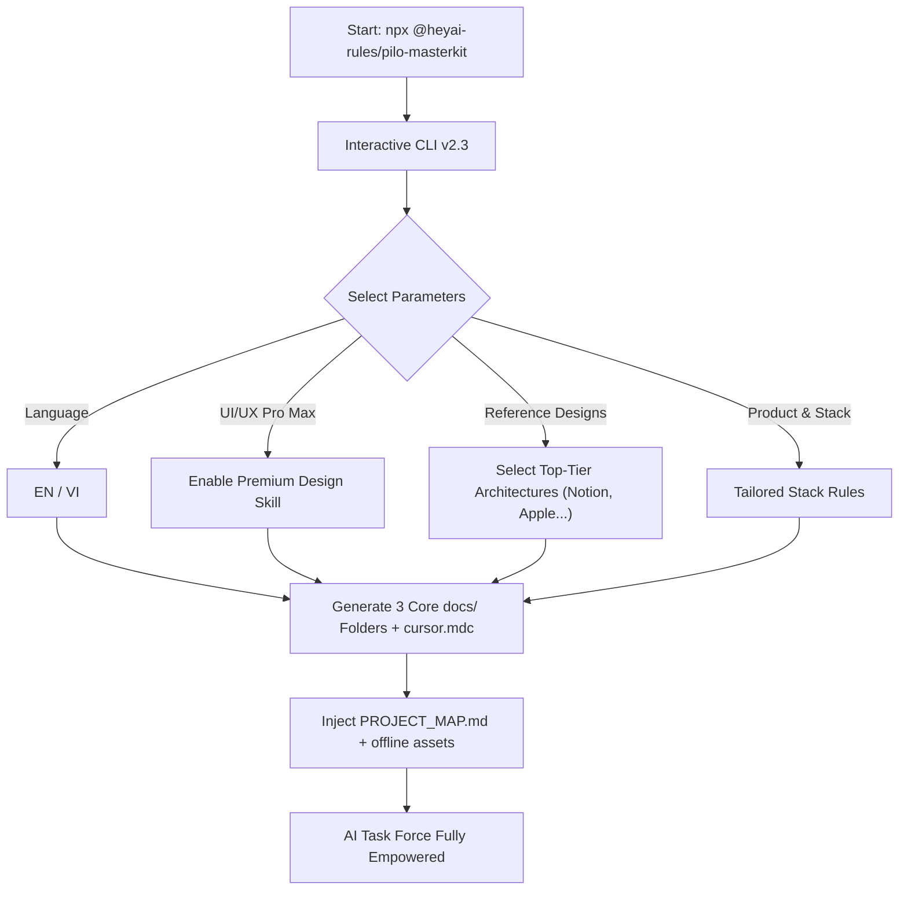

<div align="center">
  

# 🤖 Pilo Masterkit

  <p><b>The ultimate AI Coding Assistant standardizer and workspace initializer.</b></p>

[](https://www.npmjs.com/package/@heyai-rules/pilo-masterkit)
[](https://github.com/Arter2507/pilo-masterkit/releases)
[](https://opensource.org/licenses/Apache-2.0)

[**English**](#-english) | [**Tiếng Việt**](#-tiếng-việt)

</div>

---

## 🌎 English

### 🎯 Project Purpose

`Pilo Masterkit` transforms an ordinary AI Coding Assistant into a disciplined **AI Task Force**. It acts as a comprehensive "brain" for your project — solving context loss, enforcing standardized commands, strict development rules, and high-quality design systems.

### ✨ Key Features in v2.3.0

- **Streamlined Workspace (3 Core Folders)**: Creates a clean directory structure (`docs/plans`, `docs/walkthroughs`, `docs/system-designs`) to prevent context bloat and keep AI fully focused.
- **Dynamic AI Context Map (`PROJECT_MAP.md`)**: Automatically replaces standard wiki with a dynamic map registering selected tech stacks, deployment guidelines, reference designs, and specific skills.
- **Standardized AI Rules (`cursor.mdc`)**: Fully updated for Cursor IDE rules with `cursor.mdc` naming and optimized prompts for Claude, Gemini, Copilot, and Codex to prioritize `PROJECT_MAP.md` on startup.
- **World-Class Reference Architectures**: Embedded library of 71 top-tier tech system designs (Notion, Stripe, Apple, SpaceX, etc.) ready to be copied recursively into `docs/system-designs/reference/` based on user selection.
- **Advanced UI/UX Pro Max Skill**: Premium design package (45KB ruleset, CSV data, Python scripts) offline-ready to be installed in `.agent/skills/ui-ux-pro-max/` to supercharge AI design aesthetics.
- **Bilingual Wizard CLI**: Full English and Vietnamese interactive flow supporting personalized agent triggers, stacks, and scope.

### 🏗️ Workflow Architecture


```mermaid
graph TD
    A["Start: npx @heyai-rules/pilo-masterkit"] --> B[Interactive CLI v2.3]
    B --> C{Select Parameters}
    C -->|Language| D[EN / VI]
    C -->|UI/UX Pro Max| E["Enable Premium Design Skill"]
    C -->|Reference Designs| F["Select Top-Tier Architectures (Notion, Apple...)"]
    C -->|Product & Stack| G["Tailored Stack Rules"]
    D & E & F & G --> H["Generate 3 Core docs/ Folders + cursor.mdc"]
    H --> I["Inject PROJECT_MAP.md + offline assets"]
    I --> J["AI Task Force Fully Empowered"]
```

### 📸 CLI in Action


### 🚀 Quick Start

```bash
# Interactive mode (recommended)
npx @heyai-rules/pilo-masterkit@latest init

# Non-interactive: selective stack
npx @heyai-rules/pilo-masterkit@latest --stack=typescript,python --ai=claude --locale=en

# Non-interactive: full installation
npx @heyai-rules/pilo-masterkit@latest --profile all
```

_Note: You can also use `--profile all` or `--stack <name> --ai <host>` for non-interactive setup._

### 🎮 Slash Commands

You have access to a rich set of built-in commands for your AI, powered by the **Ultimate Core Skill Pack**:

#### **Core Lifecycle:**

- `/brainstorm` - Apply Socratic Gate to clarify vague requests.
- `/spec` - Write a detailed PRD/Spec before writing code.
- `/plan` - Decompose Spec into actionable, vertical-slice tasks.
- `/build` - Implement code in safe, incremental slices.
- `/test` - Ensure behavior is verified (Red-Green-Refactor).

#### **Quality & Validation:**

- `/doubt` - Adversarial self-review to prevent hallucinations/bugs.
- `/debug` - Systematic 5-step triage for resolving errors.
- `/review` - Rigorous 5-axis code quality review.
- `/simplify` - Refactor complex code to improve readability.

#### **Deployment & Environment:**

- `/ui` - Apply premium UI/UX standards and Markdown aesthetics.
- `/commit` - Manage atomic commits and version history.
- `/ship` - Pre-flight checks and safe deployment procedures.
- `/clean` - Clear memory bloat and save context state.

> [!IMPORTANT]
> **View all commands**: Check out [**Slash Commands Wiki**](./SLASH_COMMANDS.md) or your project's auto-generated `PROJECT_MAP.md`.

---

## 🇻🇳 Tiếng Việt

### 🎯 Mục đích dự án

`Pilo Masterkit` biến một AI Coding Assistant thông thường thành **Đội ngũ Đặc nhiệm AI (AI Task Force)** có kỷ luật. Công cụ này thiết lập "não bộ" tập trung ngay tại môi trường phát triển của bạn, giải quyết triệt để bài toán tràn ngữ cảnh, áp đặt quy tắc phát triển nghiêm ngặt và tích hợp kho tài nguyên thiết kế UI/UX đỉnh cao.

### ✨ Tính năng nổi bật trong v2.3.0

- **Cấu trúc Docs Tinh gọn (3 thư mục lõi)**: Tạo cấu trúc siêu sạch gồm `docs/plans`, `docs/walkthroughs`, và `docs/system-designs`, giảm nhiễu ngữ cảnh tối đa để AI hoạt động chính xác.
- **Bản đồ Dự án Động (`PROJECT_MAP.md`)**: Bản đồ điều phối tối thượng, đăng ký tất cả các tiêu chuẩn stack, deploy, các thiết kế tham khảo được lựa chọn và kỹ năng UI/UX Pro Max để AI nạp nhanh vào đầu phiên.
- **Chuẩn hóa Luật AI (`cursor.mdc`)**: Đồng bộ hóa toàn bộ chỉ dẫn nạp ngữ cảnh, đổi tên tệp cấu hình Cursor thành `cursor.mdc` và tối ưu hóa templates chỉ dẫn cho Claude, Gemini, Copilot, Codex để tập trung tối đa vào `PROJECT_MAP.md`.
- **Thư viện Kiến trúc Tham khảo Toàn cầu**: Tích hợp sẵn 71 mẫu thiết kế hệ thống hàng đầu thế giới (Notion, Stripe, Apple, SpaceX, Supabase...) ngoại tuyến, tự động sao chép vào `docs/system-designs/reference/` tùy theo lựa chọn của người dùng.
- **Quyền năng UI/UX Pro Max**: Gói tài nguyên thiết kế siêu việt (tri thức 45KB, database CSV, scripts Python) offline 100%, sẵn sàng cài đặt vào `.agent/skills/ui-ux-pro-max/` để AI thiết kế những giao diện xuất sắc nhất.
- **Bộ cài Wizard CLI Song ngữ**: Trình hướng dẫn tương tác trực quan (VI/EN) hỗ trợ cấu hình stack, quy mô, trigger cá nhân hóa và các tùy chọn tính năng nâng cao.

### 🚀 Hướng dẫn nhanh

```bash
# Chế độ tương tác (khuyên dùng)
npx @heyai-rules/pilo-masterkit@latest init

# Phi tương tác: chọn stack
npx @heyai-rules/pilo-masterkit@latest --stack=typescript,mobile --ai=gemini --locale=vi

# Phi tương tác: cài đầy đủ
npx @heyai-rules/pilo-masterkit@latest --profile all
```

_Lưu ý: Có thể sử dụng `--profile all` để cài đặt đầy đủ hoặc `--stack <name> --ai <host>` để bỏ qua tương tác._

### 🎮 Lệnh Hệ Thống (Slash Commands)

Điều khiển AI Agent thông qua **Bộ Kỹ Năng Lõi Tối Thượng (Ultimate Core Skill Pack)**:

#### **Vòng Đời Cốt Lõi (PDCA):**

- `/brainstorm` - Động não và làm rõ yêu cầu mơ hồ bằng Socratic Gate.
- `/spec` - Viết tài liệu đặc tả (Spec) trước khi code.
- `/plan` - Phân rã Spec thành các tác vụ nhỏ theo lát cắt dọc.
- `/build` - Triển khai mã nguồn theo từng bước an toàn.
- `/test` - Viết kiểm thử đảm bảo hành vi hệ thống (TDD).

#### **Kiểm Định & Chất Lượng:**

- `/doubt` - Tư duy phản biện để chống ảo giác/lỗi logic.
- `/debug` - Quy trình 5 bước gỡ lỗi có hệ thống.
- `/review` - Đánh giá chất lượng mã nguồn trên 5 phương diện.
- `/simplify` - Đơn giản hóa mã nguồn phức tạp (Refactoring).

#### **Môi Trường & Triển Khai:**

- `/ui` - Thiết kế giao diện và tài liệu đạt chuẩn cao cấp.
- `/commit` - Quản lý commit atomic và lịch sử phiên bản.
- `/ship` - Kiểm tra trước khi ra mắt và triển khai an toàn.
- `/clean` - Dọn dẹp ngữ cảnh để tránh tràn bộ nhớ.

> [!IMPORTANT]
> **Toàn bộ hệ thống lệnh**: Xem [**Slash Commands Wiki**](./SLASH_COMMANDS.md) hoặc file `PROJECT_MAP.md` được tạo tự động trong dự án.

---

## 🤝 Community & Contributing

Dự án này là mã nguồn mở và chúng tôi vinh danh mọi đóng góp để cải thiện hệ sinh thái AI.
_This project is open-source and we welcome all contributions._

- **[Giấy phép / License](LICENSE)**

---

> **"Orchestrating the technology of the future with discipline and soul."**
